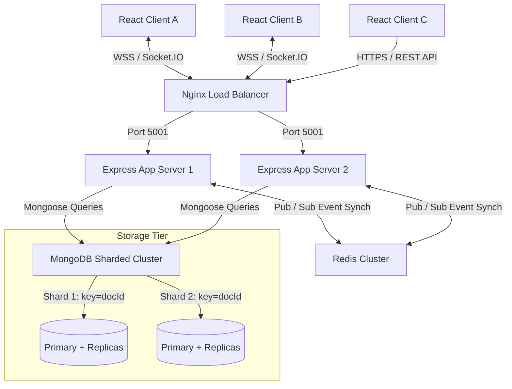
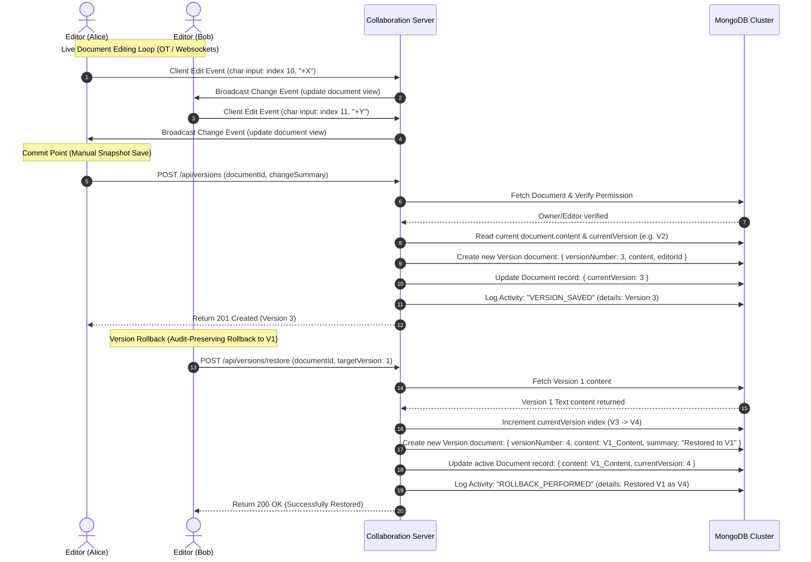

# ITM SKILLS UNIVERSITY
## Case Study Solution: Designing a Document Version Control System (VersionTrack)
**Course:** System Design | **Semester:** IV | **B.Tech CSE 2024-28**

---

## Q1. Requirements Analysis

VersionTrack is a distributed document version management platform. The requirements for this platform are categorized into functional and non-functional specifications.

### 1. Functional Requirements
*   **User Management & Security:** Secure user registration, authentication (JWT), password hashing (bcrypt), and role-based permissions.
*   **Document Operations (CRUD):** Creating, reading, updating, and soft-deleting document files.
*   **Collaborator Permissions:** Inviting collaborators with granular permission levels:
    *   *Owner:* Full administrative access, delete documents, manage collaborators.
    *   *Editor:* Modify document content, save/commit new versions, and trigger rollbacks.
    *   *Viewer:* Read-only access to working content, history timeline, and diff comparisons.
*   **Immutable Revision Commits:** Manual version checkpoint saving where the active content snapshot is committed to an immutable history registry along with an editor ID, timestamp, and text summary.
*   **Difference Comparison (Diffs):** Calculating and rendering differences between any two version snapshots (unified or side-by-side) showing line-by-line insertions (+), deletions (-), and unchanged text.
*   **Audit-Preserving Rollback:** Rolling back to a previous version without deleting subsequent history. The restored version must be committed as a *new* revision index.
*   **Real-time Synchronization:** Multi-editor synchronization, typing presence indicator updates, and collaborator online status badges.
*   **Activity Audit Trail:** A permanent ledger logging system actions (version saves, permission alterations, rollbacks) for compliance.

### 2. Non-Functional Requirements
*   **Consistency (High):** Document edits and version history must maintain sequential ordering. Readers should see updates in near real-time, and version branches must prevent divergence.
*   **High Availability & Fault Tolerance:** The application must remain responsive even if database nodes fail or network partitions occur.
*   **Scalability:** The infrastructure must scale horizontally to support millions of concurrent documents, active users, and historical revisions.
*   **Low Latency:** Document text synchronization and cursor presence events must broadcast with sub-100ms latency. Diff generation and history retrieval must execute under 200ms.
*   **Durability:** committed version history must be persistent and shielded against disk failure.

### 3. Critical System Trade-offs

```
                [ Consistency (CP) ]
                        /\
                       /  \
                      /    \
                     /  *   \  <-- VersionTrack Design Point
                    /  (OT)  \
                   /__________\
  [ Availability (AP) ]    [ Partition Tolerance ]
```

*   **Consistency vs. Availability (CAP Theorem):** In distributed editors, network partitions force a choice. VersionTrack prioritizes **Consistency** (using WebSocket rooms and central database locks/OT state validation) over pure Availability. If a user loses connection to the synchronization server, they cannot collaborate until reconnected, preventing branching conflicts.
*   **Why Consistency is Vital:** In document management, inconsistent versions lead to document corruption (e.g., two writers overwriting each other's edits, causing mixed text fragments).
*   **Why Collaboration Support is Vital:** Distributed teams require simultaneous editing. Without socket-driven real-time coordination, users face "save conflicts" where user B silently overwrites changes user A made seconds ago.
*   **Why Scalability is Vital:** Storing every keystroke or version of millions of documents grows data exponentially. The architecture must shard data efficiently and optimize indexes so history lookups do not slow down as the database grows.

---

## Q2. System Architecture Design

The distributed architecture of VersionTrack comprises stateless servers, caching mechanisms, pub/sub queues, and database clusters.

### High-Level Component Interactions



### Component Details
1.  **React Frontend Client:** Connects via REST APIs for authentication, document listing, and version diffing, and establishes persistent WebSockets (Socket.IO) for editing and presence indicators.
2.  **Load Balancer (Nginx):** Terminates SSL/TLS, balances HTTP request loads, and supports WebSocket upgrading using sticky sessions or IP-hashing.
3.  **Stateless Application Server Cluster:** Houses the Express API. It handles routes, runs middleware (JWT authentication and authorization checks), computes diffs, manages rollbacks, and coordinates Socket.IO server rooms.
4.  **Redis Cluster (Caching & Pub/Sub):** 
    *   Acts as a **Socket.IO Redis Adapter** that broadcasts collaboration events across different physical server instances.
    *   Caches user profile authentication states and document metadata to reduce database load.
5.  **Access Controller Module:** Middleware that verifies authorization permissions against database records before letting users view or modify documents.
6.  **MongoDB Sharded Cluster:**
    *   Stores users, documents, versions, and activity logs.
    *   Uses sharding keys on the version and activity collections for horizontal scalability.

---

## Q3. Document Versioning Workflow

Document lifecycle tracking involves tracking updates, managing concurrency, and handling history rollbacks.



### 1. Concurrency and Conflict Resolution
In collaborative environments, multiple users can modify a document simultaneously:
*   **Operational Transformation (OT):** Used in Google Docs. Changes are modeled as operations (Insert, Delete, Retain). If Alice and Bob make concurrent edits, the server transforms the operations based on indexes to keep the text consistent on all clients.
*   **Conflict-Free Replicated Data Types (CRDT):** Used in Figma/Yjs. Characters are assigned unique identifiers (based on client IDs and sequences). Merges are mathematically commutative, removing the need for a central coordination server.
*   **Last-Write-Wins (LWW):** In simpler implementations (such as the current Socket.IO broadcast), changes are broadcasted immediately and applied to the central model. For version checkpoints, manual commits enforce linear sequence numbering.

### 2. Audit-Preserving Rollback
A critical requirement is that history must remain immutable. If a user rolls back to an old version, the system does not delete the history between then and now.
1.  **Retrieve:** Fetch the content of the target version (e.g., version 2).
2.  **Increment:** Increment the document's version number (e.g., version 3 to 4).
3.  **Insert:** Write a new Version record (version 4) containing the content of version 2, labeled `"Restored back to Version 2"`.
4.  **Update:** Update the active document content to this text.
This maintains a linear progression of changes, making all rollbacks auditable actions.

---

## Q4. Database Design

A NoSQL model (MongoDB) is chosen for its scalability and document-oriented storage, but a relational SQL design (PostgreSQL) is also viable.

### 1. MongoDB Document Schemas (NoSQL)

```
========================================================================
                          MONGODB COLLECTION SCHEMAS
========================================================================

 [users]
  ├── _id: ObjectId (PK)
  ├── username: String (Unique)
  ├── email: String (Unique)
  ├── password: String (Hashed)
  └── createdAt: Date

 [documents]
  ├── _id: ObjectId (PK)
  ├── title: String
  ├── content: String (Active workspace text)
  ├── currentVersion: Number
  ├── owner: ObjectId -> ref: users (Index)
  ├── collaborators: Array
  │    └── [ { user: ObjectId -> ref: users, permission: "editor"|"viewer" } ]
  ├── isDeleted: Boolean
  └── createdAt/updatedAt: Date

 [versions]  <-- Shard Key: { documentId: 1 }
  ├── _id: ObjectId (PK)
  ├── documentId: ObjectId -> ref: documents (Compound Index Part 1)
  ├── versionNumber: Number (Compound Index Part 2)
  ├── content: String (Version snapshot text)
  ├── editor: ObjectId -> ref: users
  ├── changeSummary: String
  └── createdAt: Date

 [activities] <-- Shard Key: { documentId: 1 }
  ├── _id: ObjectId (PK)
  ├── documentId: ObjectId -> ref: documents (Index)
  ├── user: ObjectId -> ref: users
  ├── action: String ("VERSION_SAVED" | "ROLLBACK_PERFORMED" | ...)
  ├── details: Object (Metadata context)
  └── timestamp: Date
========================================================================
```

#### Indexing Strategy:
*   Compound index on `versions`: `{ documentId: 1, versionNumber: -1 }`. This allows fast queries when pulling historical lists or comparing versions.
*   Index on `documents`: `{ owner: 1 }` and `{ "collaborators.user": 1 }` to optimize dashboard query speeds.

---

### 2. PostgreSQL Relational Schema (SQL)

```sql
-- Create Users Table
CREATE TABLE users (
    id SERIAL PRIMARY KEY,
    username VARCHAR(50) UNIQUE NOT NULL,
    email VARCHAR(100) UNIQUE NOT NULL,
    password_hash VARCHAR(255) NOT NULL,
    created_at TIMESTAMP WITH TIME ZONE DEFAULT CURRENT_TIMESTAMP
);

-- Create Documents Table
CREATE TABLE documents (
    id SERIAL PRIMARY KEY,
    title VARCHAR(255) NOT NULL,
    content TEXT NOT NULL,
    current_version INT NOT NULL DEFAULT 1,
    owner_id INT REFERENCES users(id) ON DELETE CASCADE,
    is_deleted BOOLEAN DEFAULT FALSE,
    created_at TIMESTAMP WITH TIME ZONE DEFAULT CURRENT_TIMESTAMP,
    updated_at TIMESTAMP WITH TIME ZONE DEFAULT CURRENT_TIMESTAMP
);

-- Create Collaborators Table (Join Table with Role Permissions)
CREATE TABLE collaborators (
    document_id INT REFERENCES documents(id) ON DELETE CASCADE,
    user_id INT REFERENCES users(id) ON DELETE CASCADE,
    permission_level VARCHAR(20) CHECK (permission_level IN ('editor', 'viewer')),
    invited_at TIMESTAMP WITH TIME ZONE DEFAULT CURRENT_TIMESTAMP,
    PRIMARY KEY (document_id, user_id)
);

-- Create Document Versions Table (Immutable Snapshots)
CREATE TABLE document_versions (
    id SERIAL PRIMARY KEY,
    document_id INT REFERENCES documents(id) ON DELETE CASCADE NOT NULL,
    version_number INT NOT NULL,
    content TEXT NOT NULL,
    editor_id INT REFERENCES users(id) ON DELETE SET NULL,
    change_summary VARCHAR(255),
    created_at TIMESTAMP WITH TIME ZONE DEFAULT CURRENT_TIMESTAMP,
    CONSTRAINT unique_doc_version UNIQUE (document_id, version_number)
);

-- Create Activity Logs Table
CREATE TABLE activity_logs (
    id SERIAL PRIMARY KEY,
    document_id INT REFERENCES documents(id) ON DELETE CASCADE,
    user_id INT REFERENCES users(id) ON DELETE SET NULL,
    action_type VARCHAR(50) NOT NULL,
    action_details JSONB,
    created_at TIMESTAMP WITH TIME ZONE DEFAULT CURRENT_TIMESTAMP
);

-- Optimization Indexes
CREATE INDEX idx_collaborators_user ON collaborators(user_id);
CREATE INDEX idx_versions_doc_num ON document_versions(document_id, version_number DESC);
CREATE INDEX idx_activities_doc ON activity_logs(document_id, created_at DESC);
```

---

## Q5. Algorithm and Implementation

A Python script simulating the core version control operations is located in the root of the project at [diff_rollback.py](file:///Users/ashutoshjha/Desktop/System%20Design/diff_rollback.py).

### How the Diff Algorithm Works
*   The diffing engine is built around a Line-by-Line comparison algorithm (implemented using Python's `difflib.SequenceMatcher` and `difflib.unified_diff`).
*   It computes the Longest Common Subsequence (LCS) to match lines between the base version and the comparison version.
*   Once matched, the algorithm marks edits:
    *   Lines present in Compare but not Base are highlighted as **Additions** (`+` green).
    *   Lines present in Base but not Compare are highlighted as **Deletions** (`-` red).
    *   Lines present in both are left as **Unchanged** (reset color).
*   The script prints the comparison in two formats:
    1.  **Unified Diff**: Linear view showing insertions and deletions in line sequence.
    2.  **Side-by-Side Diff**: Two columns matching changed lines next to each other.

### Python Code Walkthrough
```python
# To execute this script and view the output simulation, run:
# python3 diff_rollback.py
```

1.  **`commit_version(content, editor, summary)`**: Increments `self.current_version`, updates `self.content`, appends a `Version` instance to the tracking list, and records a `"VERSION_SAVED"` entry in the `activity_log`.
2.  **`rollback(target_version_number, editor)`**: Verifies write access, fetches the target version's content, and calls `commit_version` with that content and a `"Restored content back to Version X"` summary. This preserves linear commit history.
3.  **`generate_diff(version_a_num, version_b_num, viewer, format_type)`**: Verifies permission, retrieves the raw content strings, splits them into lines, and computes differences. Green ANSI colors highlight insertions, and red ANSI colors highlight deletions.

---

## Q6. Scalability and Fault Tolerance

Designing VersionTrack to support millions of document revisions and concurrent editors requires horizontal scalability and fault-tolerant architecture.

### 1. Scaling to Millions of Document Revisions
Storing full text versions for every change becomes expensive. We scale storage using three strategies:
*   **Database Sharding on MongoDB:**
    We shard the `versions` and `activities` collections on the `documentId` shard key.
    
    ```
    Incoming Write (documentId: "doc-A")  ──> Shard Router (mongos)
                                                     │
                             ┌───────────────────────┴───────────────────────┐
                             ▼                                               ▼
                     [ Shard 1 (A-M) ]                               [ Shard 2 (N-Z) ]
            Stores all versions of: "doc-A", "doc-D"        Stores all versions of: "doc-P", "doc-Y"
    ```
    Sharding by `documentId` ensures all versions for a document live on the same physical shard. Queries for a document's history run locally on one shard, avoiding cross-shard joins.
*   **Delta Compression (VCDIFF/RCS):**
    Instead of storing full text snapshots for every revision, older versions are stored as reverse deltas. The active version is saved as full text (for fast loads), and older versions are generated by applying sequential differences backward.
*   **Cold Data Offloading:**
    Active documents and the latest 5 revisions live in hot MongoDB memory/SSD storage. Revisions older than 30 days are compressed and moved to object storage (like AWS S3 / Google Cloud Storage), which reduces database size and cost.

### 2. Scaling Concurrent Editors
*   **WebSocket Clustering:** We run multiple node server instances behind Nginx. Since WebSockets maintain persistent connections, we use a Redis pub/sub backplane to sync messages between servers.
*   **Keystroke Debouncing & Batched Updates:** To prevent socket flooding, local changes are debounced on the client (e.g., every 150ms) before broadcasting to other collaborators.

### 3. Failure Management & Fault Tolerance
*   **Database Failures (MongoDB Replica Sets):**
    Each shard is a replica set consisting of 1 Primary and 2 Secondary nodes. If the primary node crashes, the secondary nodes elect a new primary within seconds.
    
    ```
    [ Client Application ] 
             │ (Write Concern: majority)
             ▼
      [ Shard Primary ] ──(Replication)──> [ Shard Secondary 1 ]
             │
             └────────────(Replication)──> [ Shard Secondary 2 ]
    ```
    Using `w: "majority"` write concern guarantees that a version write is written to at least two replicas before acknowledging success, preventing data loss if the primary fails.
*   **Storage Corruption Handling (Content Hashing):**
    When a version is saved, the server calculates a SHA-256 hash of the content and stores it in the metadata. When a version is read, the content is hashed again and verified against the metadata. If a mismatch is detected, the version is flagged as corrupted, and is restored from database backup replicas.
*   **Soft Deletion Safeguards:**
    Documents are never hard-deleted from the database when users click "Delete". Instead, `isDeleted: true` is set, preserving historical versions and audit logs for recovery and compliance.
